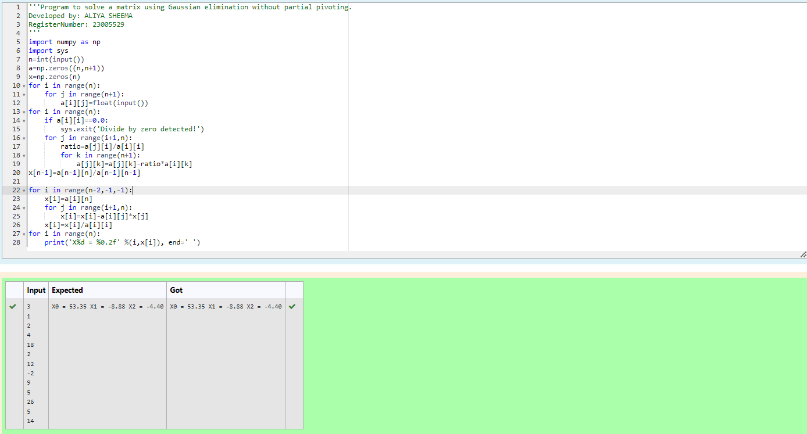

# Gaussian Elimination
NAME : ALIYA SHEEMA

REFERENCE NUMBER : 23005529

DEPARTMENT : AIDS
## AIM :
To write a program to find the solution of a matrix using Gaussian Elimination.

## EQUIPMENTS REQUIRED :
1. Hardware – PCs
2. Anaconda – Python 3.7 Installation / Moodle-Code Runner

## ALGORITHM :
1. Initialize n×(n+1) matrix a and a solution vector x with zeros.
2. Populate the augmented matrix a with coefficients from user input.
3. Starting from the last equation, solve for x values backward using the transformed matrix a.
4. Run the code.

## PROGRAM :
```
/*
Program to find the solution of a matrix using Gaussian Elimination.
Developed by: ALIYA SHEEMA
RegisterNumber: 23005529
*/
import numpy as np
import sys
n=int(input())
a=np.zeros((n,n+1))
x=np.zeros(n)
for i in range(n):
    for j in range(n+1):
        a[i][j]=float(input())
for i in range(n):
    if a[i][i]==0.0:
        sys.exit('Divide by zero detected!')
    for j in range(i+1,n):
        ratio=a[j][i]/a[i][i]
        for k in range(n+1):
            a[j][k]=a[j][k]-ratio*a[i][k]
x[n-1]=a[n-1][n]/a[n-1][n-1]

for i in range(n-2,-1,-1):
    x[i]=a[i][n]
    for j in range(i+1,n):
        x[i]=x[i]-a[i][j]*x[j]
    x[i]=x[i]/a[i][i]
for i in range(n):
    print('X%d = %0.2f' %(i,x[i]), end=' ')
```

## OUTPUT :

Program to find the solution of a matrix using Gaussian Elimination.




## RESULT :
Thus the program to find the solution of a matrix using Gaussian Elimination is written and verified using python programming.

